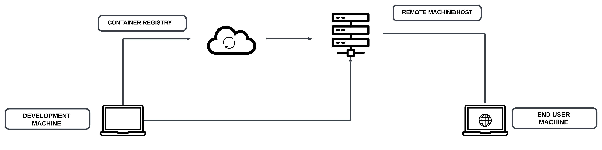

# Deploying a Docker Container with React.js Web Application on Amazon EC2





 This guide outlines the steps to deploy a React.js web application inside a Docker container on an Amazon EC2 instance. By following these steps, you'll be able to host your web application and access it via a web browser.

AWS EC2 is a service that allows you to spin up and manage your own remote machines.
Steps:
1.	Create and launch EC2 instance, VPC and security group
2.	Configure security group to expose all required ports to WWW.
3.	Connect to instance (SSH), install Docker and run container.

# Prerequisites

1. AWS account with access to the AWS Management Console
  
2.  Basic knowledge of AWS services, SSH, and Docker.

# Steps

# 1. Launch EC2 Instance, VPC, and Security Group

1. Log in to your AWS Management Console.
2. Navigate to EC2.
3. Launch a new instance using the Amazon Linux 2023 AMI (or a suitable instance based on your requirements).
4. Choose the t2.micro instance type for the free tier.
5. Select a default VPC.
6. Create a new key pair and download the key pair file (.pem).

    When the instance is up and running , we will connect via SSH.

    SSH, which stands for Secure Shell, is a cryptographic network protocol that provides a secure and encrypted way to access and manage remote servers and systems. In the context of Amazon EC2 (Elastic Compute Cloud), SSH is used to securely connect to Linux-based EC2 instances for tasks like configuration, maintenance, and application deployment.

    It is a command line to connect to remote machine from our machine. On linux and MacOS devices we will be able to use the regular terminal and we already have a ssh command which we can use to establish such a SSH connection. But on Windows it is not builtin. 

    On Windows we will need to setup WSL2. 

    WSL2, short for Windows Subsystem for Linux 2, is a feature of Microsoft Windows that allows you to run a Linux distribution alongside the Windows operating system.

# INSTALL WSL2 ON WINDOWS:

Pre-requisites to run wsl2:

To run WSL2, Windows 10 should have the below versions, 

•	For x64 systems: Version 1903 or higher, with Build 18362 or higher.

•	For ARM64 systems: Version 2004 or higher, with Build 19041 or higher.


To install WSL2 on Windows 10/11:
1.	Open ‘Turn Windows features on or off’ on your Windows Computer
2.	Enable ‘Virtual Machine Platform‘ and ‘Windows Subsystems for Linux‘ features
3.	Restart Computer
4.	Install Linux Kernel Updates Package from https://wslstorestorage.blob.core.windows.net/wslblob/wsl_update_x64.msi install with administrative privileges. 
5.	Finish the Installation of Linux Kernel Updates Package
6.	Install the Linux Distribution : From   Microsoft store we can download Ubuntu.
7.	Launch Ubuntu
8.	Configure Login account in Ubuntu in WSL2.  


    After installing WSL2 we would be able to run ssh commands , we will click the connect button. 
    It will give us the instructions on how to connect to the instance. 

    Using this command will connect us to the instance:

```bash
ssh -i path/to/keypair.pem ec2-user@<EC2-INSTANCE-PUBLIC-IP-ADDRESS>
```

Following the steps on the Connect To Instance page we will be able to connect to ec2 instance.
The terminal will show like this after connection

```[ec2-user@ip-172-31-41-140 ~]$```

# 3. Install Docker on the EC2 Instance

1. Update package information:
```bash 
sudo yum update -y
```
2. Install Docker:
```bash
sudo amazon-linux-extras install docker
sudo yum install -y docker
```

3. Start Docker:
```bash
sudo service docker start
```

# 4. Deploy the React.js Web Application in a Docker Container:


1. Pull your React.js web application's Docker image (replace affan03/example-2 with the actual image name):
```bash
sudo docker pull affan03/example-2
```

2. Run the Docker container:

```bash 
sudo docker run -d --rm -p 3000:3000 affan03/example-2
```

# 5. Configure Security Group:

1. In the AWS Management Console, navigate to EC2.
2. Under your instance's launch wizard, click Edit inbound rules.
3. Add a new Custon TCP rule to allow traffic on port 3000.
4. Change the source to "Anywhere IPV4"
4. Save the changes.

# 6. Access Your Web Application:

1. Obtain your EC2 instance's public IP address.
2. Open a web browser and enter the following URL:

```http://<EC2-INSTANCE-PUBLIC-IP-ADDRESS>:3000```
